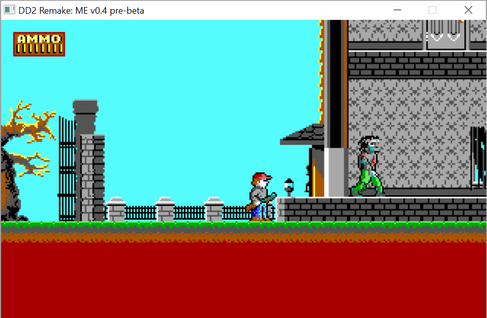
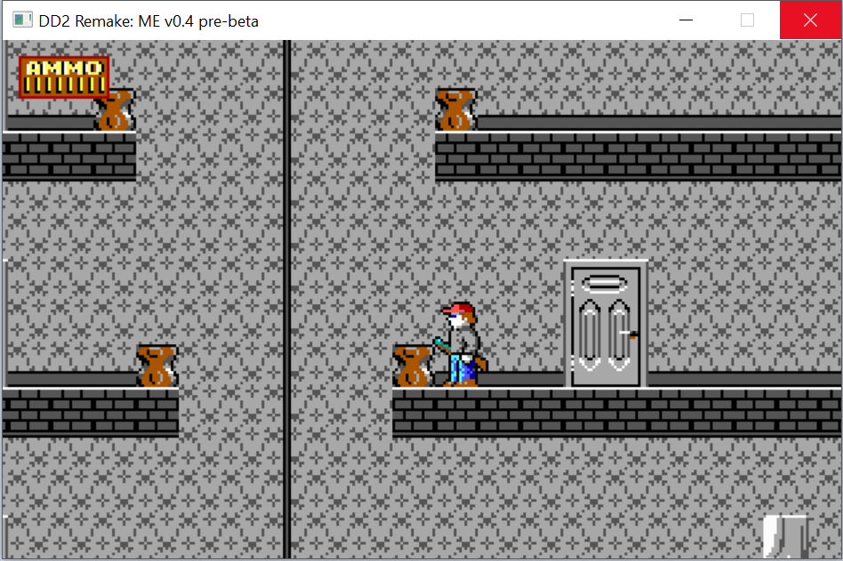
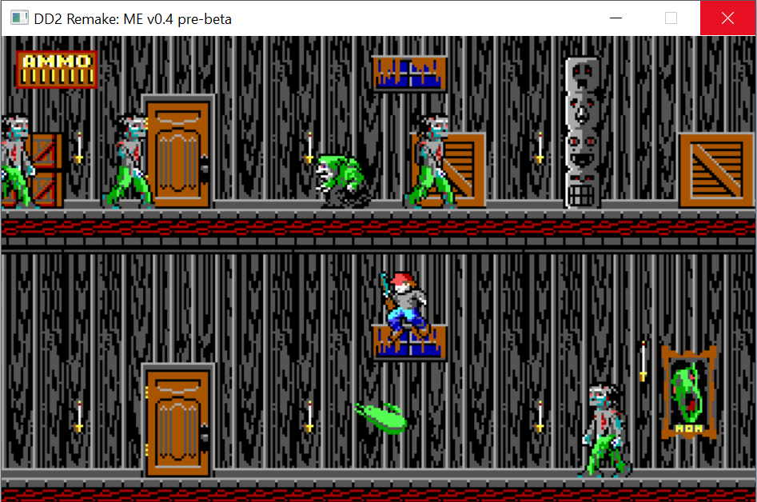
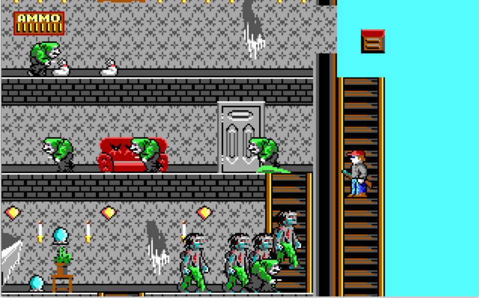
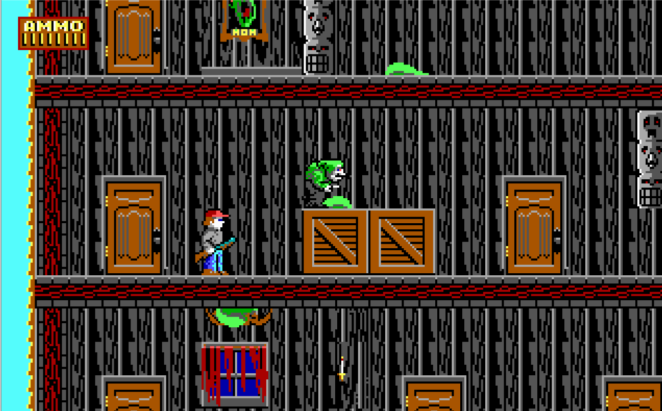
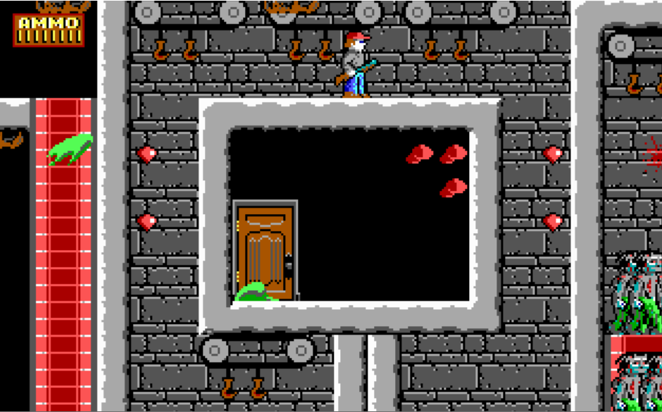
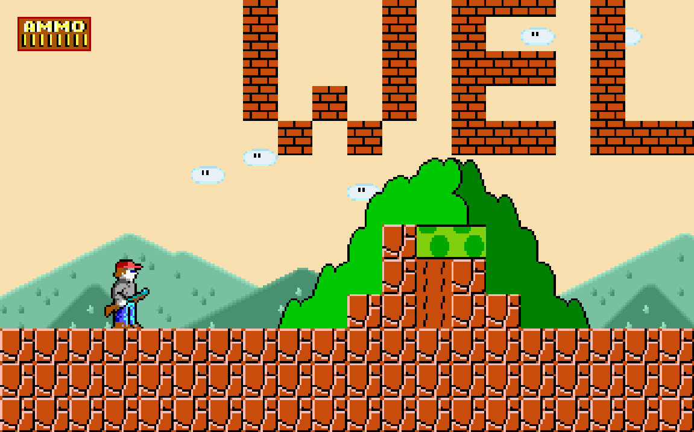
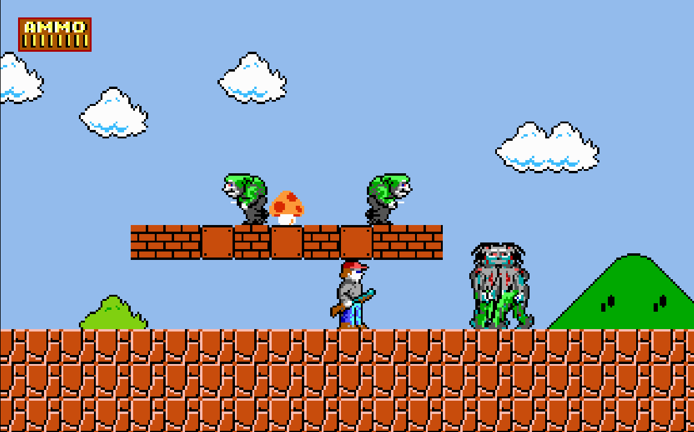
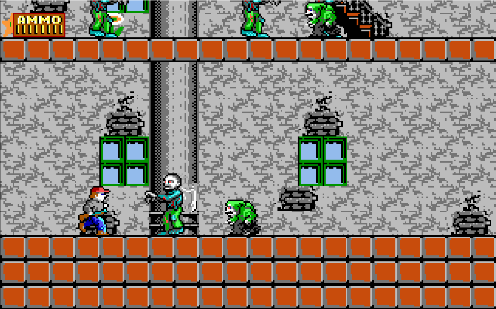
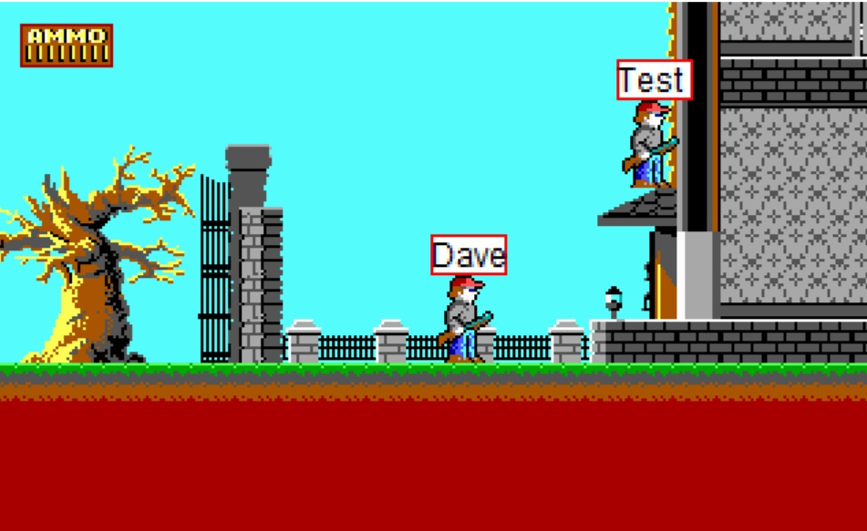

# Dangerous Dave 2: Modification Edition
This is an open-source remake of a well-known platform game Dangerous Dave 2 with flexible and highly customizable core and many new features.
This project has a repository on the sourceforge (I created it in 2013 year), but it is currently not supported there. Link: https://sourceforge.net/projects/dd2moded/

**Now you can play (in addition to standard levels) in additional levels! For it choose levelpack in launcher!**

**Attention**: this development is a software shell that loads external modules (modpacks). The program code does not contain anything copyrighted by the original dangerous dave.

# Screenshots
Standard Game:

   

Additional levelpacks without troubles:

   

SuperDangerousDave modpack (Dangerous Dave in Mario World):

   

And a little preparing network mode:

# Download
Last version (v0.9 pre-beta, **9 july, 2022**): <a href="https://github.com/Harchvertelol/Dangerous-Dave-2-Modification-Edition/releases/tag/v0.9pre-beta-win" target="_blank">open</a>, <a href=https://github.com/Harchvertelol/Dangerous-Dave-2-Modification-Edition/releases/download/v0.9pre-beta-win/DD2MEv0.9pre-beta.rar>direct link</a> 
All versions: <a href="https://github.com/Harchvertelol/Dangerous-Dave-2-Modification-Edition/releases" target="_blank">open</a>

# Support project
If you want, you can support this project. I have been doing it for more than 10 years, I will be grateful for any support. Thanks a lot anyway! Goal: "Dangerous Dave 2: Modification Edition". 
Support link: <a href="https://www.donationalerts.com/r/harch" target="_blank">support</a>

# Control
Arrow keys for run and aim; left ctrl - jump; left alt - shoot. This setting you can change in DD2.ini.

# Attention
Almost all English texts in the accompanying files (documentation, readme, changes) are translated automatically, therefore, most likely, they contain any inconsistencies or incidents. If you notice something like this, then you can create issue.

# About versions
Warning: game versions 0.2 and 0.3 do not have source code and are laid out with empty source code archives. This is due to the fact that initially the project was not on the repository, and its source code was not saved from version to version.

# About project
## Done
1. Any level size.
2. Any number of monsters, things, and so on.
3. When creating a level, you can put a monster on a bonus, on leaving the door, and so on (many masks).
4. Animation of tiles + it is possible to change their type depending on the animation frame (for example, make traveling shelves).
5. All resources are taken out with parameters, which allows you to change something very simply. Support for various "packs".  
While packs are supported:
 - Texturepacks
 - Monsterpacks
 - Davepacks
 - Levelpacks
 - Bonuspaks
 - Screenpacks
 - Soundpacks
 - Musicpacks
6. Flexible settings.
7. The new level format, that is, the original levels from the Dangerous Dave 2 will NOT work. But, thanks to Crazy Daver, he wrote the converter.
8. All the features of the original Dangerous Dave 2 are supported.
9. The modpack has the ability to load its .ini settings file. Not particularly tested. Possible terrible bugs with a difference in values variables in the video section.
10. Added console. Press '~', switch to the MS-DOS emulator window, enter commands.
11. Added a launcher for the interface for changing various "packs" and settings.

## In the plans
1. Monster generators (read "respawn points"). Needed for arena maps.
2. Network mode:
 - Cooperative
 - Deathmatch
 - Deathmatch team
 - Last Hero
 - Co-op team against monsters. Who remained in the end - won.
 - Each type will have the ability to enable and disable monsters (exception - cooperative).
3. Fix the first splash screen.
4. Add menus with text, as in the original dave.
5. Make a compatibility check of any packs with the mod.
6. Make a port on android (this is in the distant plans).
7. Add save points directly on the map.
8. There will be no bugs of the old Dangerous Dave 2, like shooting through a wall, going through a wall and so on.
